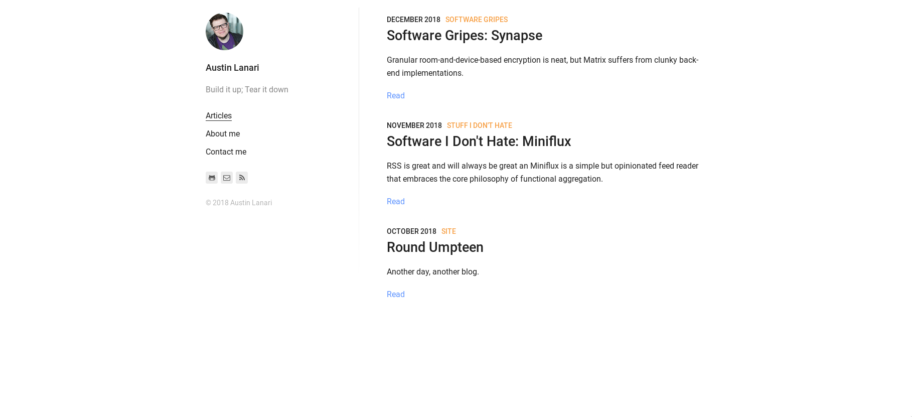

As I'm writing this on my local machine (thank goodness the newest Manjaro kernel update didn't force me to write C to fix a driver again), austinlanari.com looks like this:

* The 'Read' links are redundant
* The sidebar just sits on top looking like that on mobile
* People coming to austinlanari.com know that this "Austin Lanari" fellow has a blog and... that's pretty much all they know (and maybe they catch the Fatboy Slim reference?)

The new site has a header and footer on every page. The header is just for consistency, but the footer actually tells you enough about me to be satisfying.

Eventually (when I'm not about to head out the door), there will be a more visually interesting blurb about me above the post feed on the home page (so that austinlanari.com actually gives you something about "Austin Lanari" above the fold). I also plan on updating the post links now that they're not flanked by a sidebar to not be so text-driven. Until then, I'm happy with the simplicity of the new layout and the fact that it's consistent across platforms.

I almost jumped ship (again!!) to Hugo or to a new Gatsby theme, but the folks who threw this theme together did a great job organizing the relevant `.scss` files. It was only a _little_ over-engineered with respect to comments and site-level configs, but not anywhere close to other Gatsby sites.
